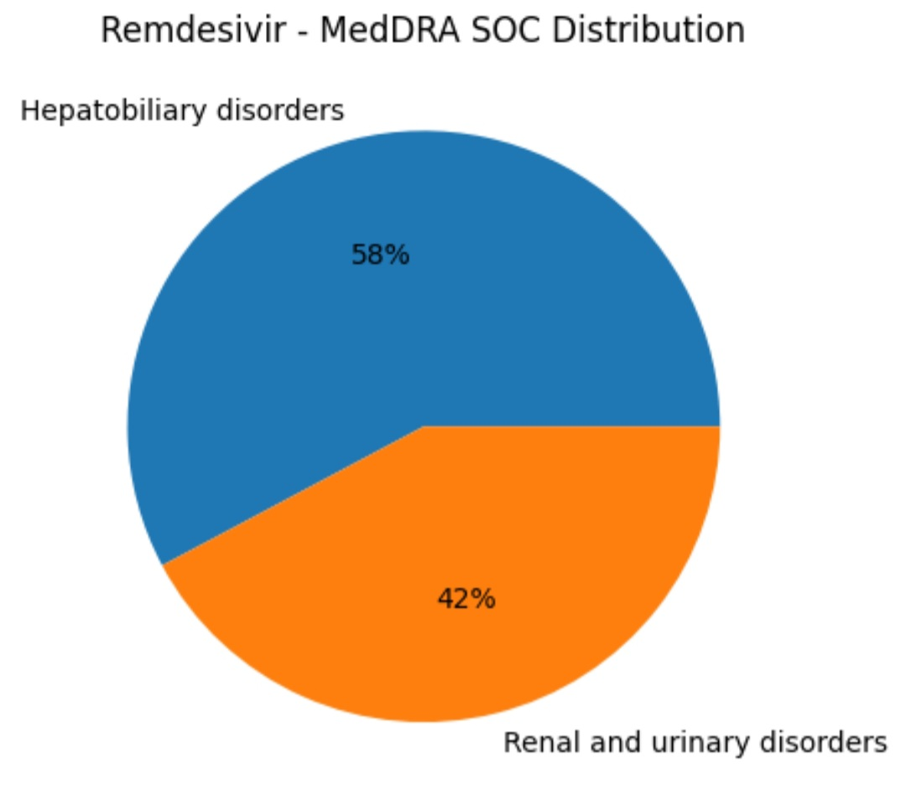

# Remdesivir FAERS Analysis Q3 2020 | Pharmacovigilance

**FDA FAERS Q3 2020 | n=1911 Reports | Drug Safety & Signal Detection**

### Objective
Real-world safety profiling of Remdesivir during COVID-19 using FDA Adverse Event Reporting System.

### Key Findings (Top 10 ADRs)
1. ALT Increased - 460 (24.1%)
2. AST Increased - 291 (15.2%)
3. Acute Kidney Injury - 167 (8.7%)
4. Hypotension - 111
5. Bradycardia - 96
6. Respiratory Failure - 93
7. Acute Respiratory Failure - 91
8. Death - 86
9. Blood Creatinine Increased - 81
10. Renal Impairment - 75
## Visualizations

.png)
**Safety Signals:** Hepatotoxicity & Nephrotoxicity

### Methodology
- Data Source: FAERS ASCII Q3 2020
- Tools: Python, Pandas, Matplotlib
- Standards: MedDRA PT coding, GVP Module VI
- Analysis: Frequency analysis & disproportionality screening

### Files
- `remdesivir-faers-analysis.ipynb` - Full code + visualizations (Open in Colab ready)

### Author
Nooshin Sina | Pharmacovigilance / Drug Safety | Aspiring PV Specialist
